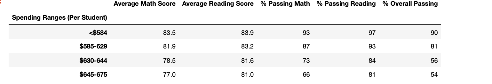

# School_District_Analysis
## Overview of the school district Analysis
* The purpose of the analysis was because it has come to our attention that we had some dishonest students at Thomas School that might have skewed the overall results for all the school.  This would affect overall when comparing to other schools in terms of budgets, size and performance.  In order to provide a full analysis and insight, we would need to remove the score from Thomase to provide a true picture of the overall results. 
* 
## Results 
- After remove the 9th and 10th graders from the results, you can see below that it had a very slight impact of the overall results. 

* Overall results for Thomas School is as follows:
  * Passing percentage for Thomas school fell to 65%, while the district fell to about 64%
* Even though we had dishonest students it still didn't improve the overall ranking of the school.  Thomas school was still performing the lowest compared to the other schools. 
## Replacing the ninth graders had the following changes:
  * Math and reading scores had a slight increase of about .06 which is not much. 
  * When looking at the budgets, it's clear that spending does not increase as students get better scores. With this analysis, we can conclude there's no coorelation between the       spending budgets and student scores.

* Below is the summary of school size and their average scores.  It's clear that as the school size are small, students tend to have do better and have a higher average for both reading and math.  This is clear that students that have a large school size of over 2000 tend to do worse for both reading and math.  It could be there's not enough teachers to give all students the attention that they need. 

* It's clear that charter school tend to do better than district. For next steps, they might want to look at what the charters school are doing different than district schools. 

## Summary
Due to the new data results, it has caused different results from removing the reading and math scores. By replacing Thomas School scores, it shifted them to one of the lowest performing scores when they were originally the top performing.  Secondly, because the 9th and 10th grader scores were replaced, this affected the overall average scores for the district which was a big impact when comparing to the charter schools.  However, Thomas school still had a strong  average math and reading score despite the current news and situation. 
