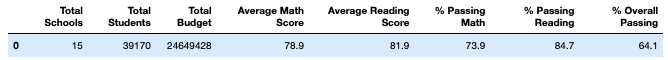

# School_District_Analysis
## Overview of the school district Analysis
## Results 
- Even though we had dishonest student at the Thomas high school, you can see it did not impact the overall school. 

- Overall results for Thomas School is as follows:
--  Passing percentage for Thomas school fell to 65%, while the district fell to about 64%
-- Even though we had dishonest students it still didn't improve the overall ranking of the school.  Thomas school was still performing the lowest compared to the other schools. 
-Replacing the 

## Summary
