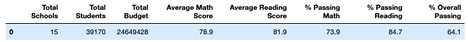
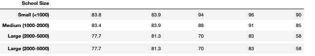
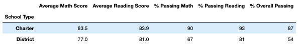

# School_District_Analysis
## Overview of the school district Analysis
## Results 
- Even though we had dishonest student at the Thomas high school, you can see it did not impact the overall school. 

* Overall results for Thomas School is as follows:
* Passing percentage for Thomas school fell to 65%, while the district fell to about 64%
* Even though we had dishonest students it still didn't improve the overall ranking of the school.  Thomas school was still performing the lowest compared to the other schools. 
* Replacing the ninth graders had the following changes:
* Math and reading scores had a slight increase of about .06 which is not much. 
* When looking at the budgets, it's clear that spending does not increase as students get better scores. With this analysis, we can conclude there's no coorelation between the spending budgets and student scores.

* Below is the summary of school size and their average scores.  It's clear that as the school size are small, students tend to have do better and have a higher average for both reading and math.  This is clear that students that have a large school size of over 2000 tend to do worse for both reading and math.  It could be there's not enough teachers to give all students the attention that they need. 

* It's clear that charter school tend to do better than district. For next steps, they might want to look at what the charters school are doing different than district schools. 

## Summary
